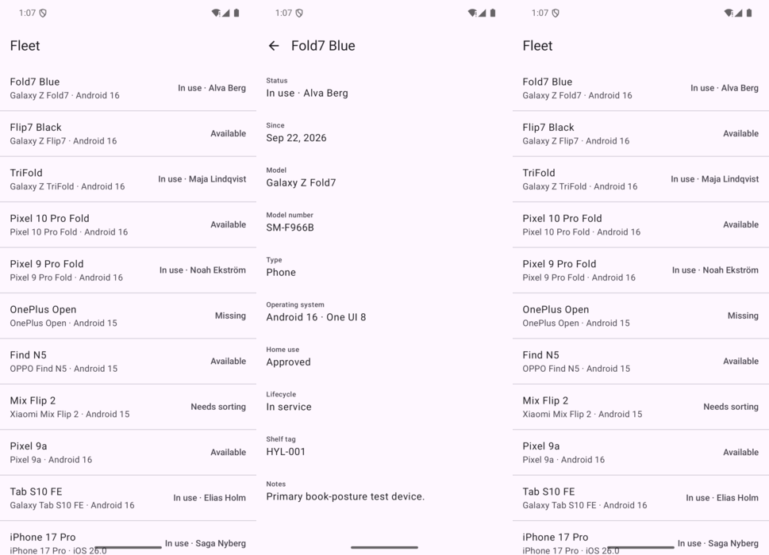
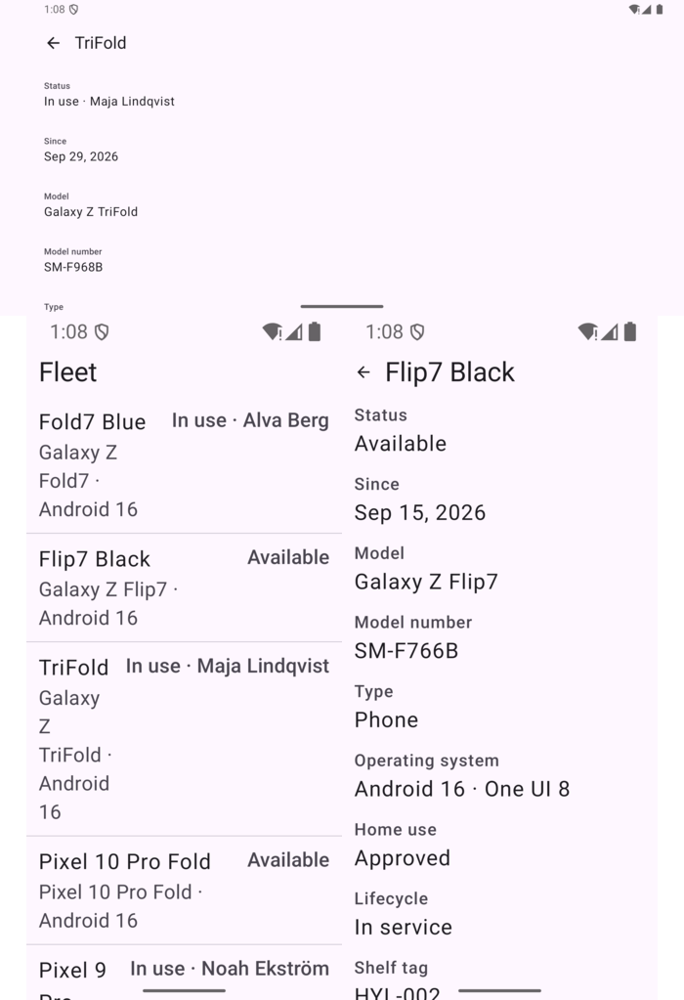
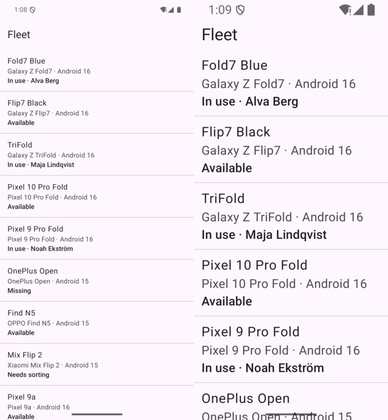
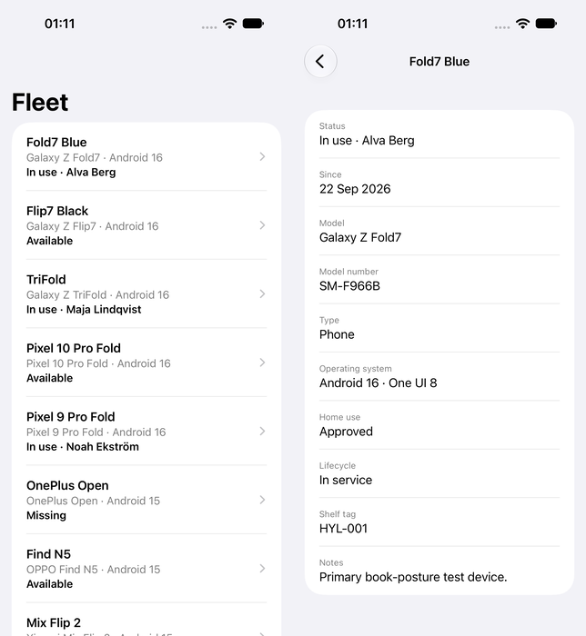
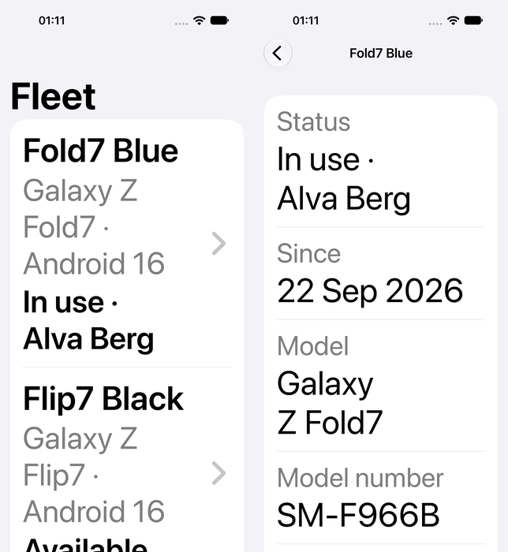
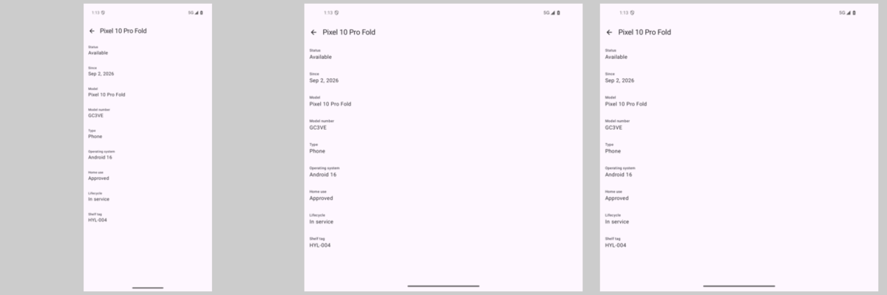

# 03 — Baseline compact app: fleet list and detail

**Tag:** `chapter-03`

## The concept

The smallest app that does the job: a list of the fleet, and a detail screen for one device,
reached by navigation. One screen at a time, everywhere.

This is deliberately the *compact* app, and it runs unchanged on every window. On an unfolded
foldable or an iPad it is a single column stretched across the whole width. That is the "before"
for chapters 4 to 6, which keep this navigation and change only what is shown side by side.

## In pictures



*Fleet, detail, and back to the fleet.*



*Before: rotation keeps the detail (top), but at 200% the trailing status squeezed the model into one word per line.*



*After: status on its own line, at 100% and 200%.*



*iOS: fleet and detail.*



*iOS at the largest accessibility size: everything wraps.*



*The open detail survives closed, opened and half-opened — and is a single stretched column, the "before" for chapter 4.*

## Navigation

| | Android | iOS |
| --- | --- | --- |
| Library | Navigation 3 (`androidx.navigation3`) | `NavigationStack` |
| Destinations | `@Serializable` keys: `FleetRoute`, `DeviceRoute(id)` | `navigationDestination(for: Device.ID.self)` |
| Back stack | `rememberNavBackStack(FleetRoute)`, a saveable list | `@State var path: [Device.ID]` |
| Back | `NavDisplay(onBack = { backStack.removeLastOrNull() })` | System back button and edge swipe |

**Why Navigation 3 and not Navigation Compose.** In Navigation 3 the back stack is a plain list
that the app owns. The two-pane and three-pane layouts in chapters 5 and 6 are then just a
different way of *showing* the same list: the top two entries side by side instead of only the
top one. With Navigation Compose the graph owns the stack, and adaptive layouts end up working
around it.

**The detail is addressed by shelf tag.** Both platforms navigate with the device id, never
the device itself. A destination that carries only an id survives being saved and restored. It
is also exactly what a deep link (chapter 13) or a scanned tag (chapter 14) delivers. An unknown
id shows *Not found* instead of crashing, because deep links will produce them.

**The back stack survives recreation.** On Android, a fold, a rotation or a density change
recreates the Activity. `rememberNavBackStack` saves the keys, so the detail you were reading is
still there afterwards. On iOS none of those events recreate the scene, so `@State` is enough
for now. Restoration after the app is killed comes with deep links in chapter 13.

## Display text

The fixture stores codes (`inUse`, `officeOnly`). Each platform maps them to text in one file:

- Android: `FleetLabels.kt`, which maps each code to a string resource.
- iOS: `FleetLabels.swift`, which uses `String(localized:)`.

No screen formats a code itself. `since` is formatted with the platform's medium date style in
the current locale, which is why it shows *Sep 22, 2026* on the Android emulator and *22 Sep 2026*
on the iOS simulator.

## What went wrong on the way

**The status label squeezed the model name at 200%.** The first Android row put the status
(`In use · Alva Berg`) in the `ListItem` trailing slot. At 200% font scale the trailing text took
half the row, and the model line wrapped one word per line: `Galaxy / Z / TriFold`. The status
now has its own line under the model, on both platforms, so the row only grows taller. This is
the same rule as *never stretch*, applied to text: when space runs out, stack, don't squeeze.

**A semantics modifier that did nothing.** The detail rows first wrapped each `ListItem` in
`Modifier.semantics(mergeDescendants = true)`. A mutation test showed that removing it changed
nothing: Material 3's `ListItem` already merges its slots into one node. The modifier is gone,
and the test that guards the behaviour stays.

## Accessibility

- **One element per row.** A fleet row is a single clickable element that reads the device
  name, the model line and the status.
- **One element per detail field.** It reads label then value: *Model, Galaxy Z Fold7*.
- **Proven by tests, not by inspection.**
  - Android: `onNode(hasText("Model") and hasText("Galaxy Z Fold7"))` on the merged tree.
  - iOS: `app.staticTexts["Model, Galaxy Z Fold7"]`.

  On iOS the test fails when `.accessibilityElement(children: .combine)` is removed.
- **Large text.** Detail fields put the label above the value, so the largest sizes wrap instead
  of colliding.
- **Back.** The back button has a label (*Back*), and system back works on both platforms.

## Verify

```sh
cd android
./gradlew :app:testDebugUnitTest                                    # 26 unit tests
ANDROID_SERIAL=emulator-5554 ./gradlew :app:connectedDebugAndroidTest   # 5 instrumented tests

cd ios
xcodebuild -project Hylla.xcodeproj -scheme Hylla \
  -destination 'platform=iOS Simulator,name=iPhone 18 Pro,OS=27.2' test  # 26 unit + 2 UI tests
```

Set `ANDROID_SERIAL` when more than one device is connected. Without it, `connectedAndroidTest`
installs and runs on every attached device, including phones from the shelf that happen to be
plugged in.

| Check | Android | iOS |
| --- | --- | --- |
| List → detail → back | `pixel6pro_api35`, up button and system back | iPhone 18 Pro, iOS 27.2 |
| Detail survives recreation | `scenario.recreate()`, rotation, and on `fold_api36` closed → opened → half-opened | n/a: the scene is not recreated |
| 200% / largest text | Font scale 2.0, list and detail | `AccessibilityXXXL`, list and detail |
| Screen reader nodes | Merged-tree assertions | Combined-label assertions |

Not verified: a full TalkBack or VoiceOver walk with the services running. The assertions prove
which nodes the readers receive, not how they are spoken.
