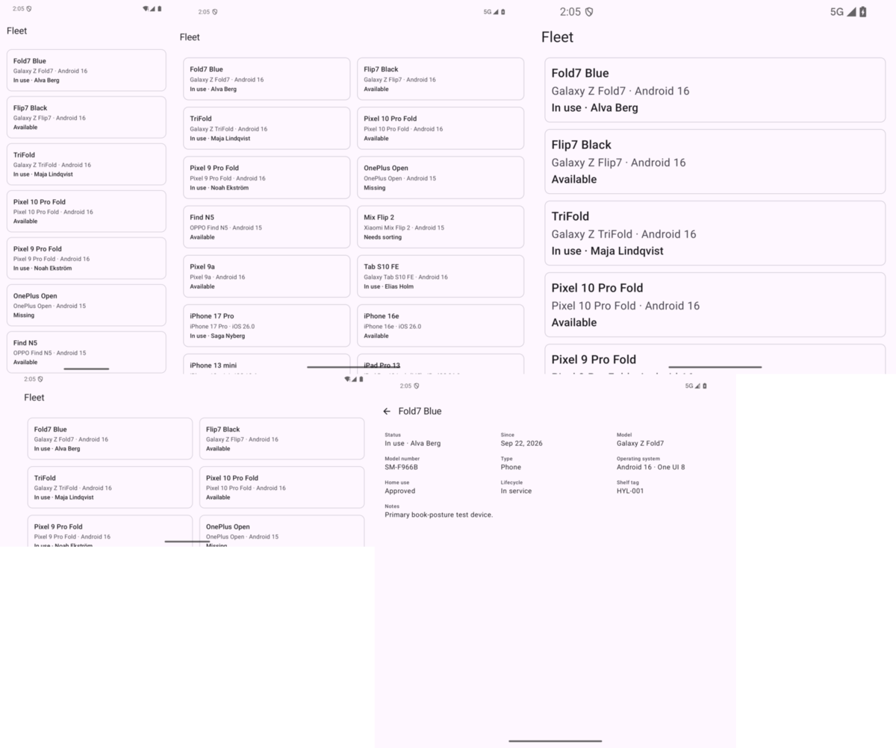
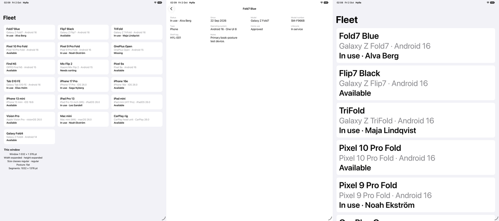

# 04 — Adaptive values and column counts

**Tag:** `chapter-04`

## The concept

**Never stretch.** When a container gets wider, its content gains columns. It does not grow one
column to fill the space.

This chapter applies that rule inside a single pane. It does it with two kinds of adaptive
value, and keeping them apart is the point of the chapter:

| Value | Driven by | Why |
| --- | --- | --- |
| Margins and gutters | The **window's** width class | Spacing is part of how the whole window reads. |
| Column count | The **container's** measured width | In chapter 5 a pane is narrower than the window it sits in. A count taken from the window would put three columns in a pane that has room for one. |

## In pictures



*Phone portrait (1 column), unfolded (2), unfolded at 200% (1), phone landscape (2), unfolded detail (3 field columns).*



*iPad portrait: 3 fleet columns and 4 detail columns; at the largest text size, 1 wider column.*

## Before

Chapter 3 drew one column everywhere. On an unfolded foldable a device row was 852 dp wide:
the name was at the far left and the white space ran on for most of the screen. On an iPad in
landscape a detail field was 1376 pt wide with eleven characters in it.

## The numbers

Shared by both platforms, defined in `AdaptiveLayout` (Kotlin and Swift):

| Constant | Value |
| --- | --- |
| Margin | 16 compact, 24 otherwise |
| Gutter | 12 compact, 16 otherwise |
| Fleet tile minimum width | 280 |
| Detail field minimum width | 220 |
| Minimum legible pane width | 360. Not used yet; chapter 5 collapses a pane rather than go below it |
| Text-scale cap | 2× |

**Column count:** `max(1, floor((available + gutter) / (minimum + gutter)))`.

- A column is never narrower than its minimum, unless even one column does not fit, in which case
  there is still one.
- A column is never as wide as twice its minimum plus a gutter, because at that width the next
  column fits.

Both test suites sweep widths from 300 to 2400 and check that bound.

**The minimum grows with text size.** A 280 dp tile is legible at 100% text. At 200% the same
words need roughly twice the width. The minimum is multiplied by the user's text scale, capped
at 2×:

- Android reads `LocalDensity.current.fontScale`.
- iOS reads `UIFontMetrics(forTextStyle: .body).scaledValue(for: 1)` at the current
  `dynamicTypeSize`.

At the largest sizes the grid falls back to fewer, wider columns instead of breaking words.

## Why not `GridCells.Adaptive` and `GridItem(.adaptive)`

Both platforms have an adaptive grid primitive, and both use the formula above. They are not
used here for three reasons:

- The count has to be unit tested.
- The count has to come out the same on both platforms for the same input.
- The minimum has to scale with text size.

Each platform computes the count with its own `AdaptiveLayout.columns` and gives the grid a
fixed count: `GridCells.Fixed(n)` on Android, and `n` flexible `GridItem`s on iOS.

## Measuring the container

- **Android.** `BoxWithConstraints` gives the grid its own `maxWidth`. The Scaffold's inset
  padding and the margin are subtracted before the count is computed, so a display cutout in
  landscape costs columns, not overlap.
- **iOS.** The grid measures itself with `onGeometryChange`. A `ScrollView` already sits inside
  the safe area, so in landscape the notch side is excluded without extra work.

Neither platform uses the window size for the count, and neither wraps the screen in a
`GeometryReader`.

## Decision: landscape gains columns, not panes

The layout table says a compact landscape window stays *one logical column* and must not split.
Here that means one pane: fleet *or* detail, reached by navigation, exactly as in portrait.

Inside that pane, a phone on its side gets two columns of tiles, because the width is there:

- 891 dp is `Expanded` width on Android.
- 874 pt on iOS, minus the safe area, still fits two.

Splitting into fleet ∣ detail panes is chapter 5, and that decision reads the height class as
well, which is `Compact` in phone landscape.

## Observed

| Window | Fleet columns | Detail columns |
| --- | --- | --- |
| Phone portrait (`pixel6pro_api35`, iPhone 18 Pro) | 1 | 1 |
| Phone landscape (`pixel6pro_api35`, iPhone 18 Pro) | 2 | — |
| `fold_api36` opened, 852 dp | 2 | 3 |
| `fold_api36` opened, font scale 2.0 | 1 | — |
| iPad Pro 13" portrait, 1032 pt | 3 | 4 |
| iPad Pro 13" landscape, 1376 pt | 4 | — |
| iPhone 18 Pro, largest accessibility size | 1 | 1 |

## What went wrong on the way

**Rotated simulator screenshots lie.** The first landscape UI test attached a screenshot. The
image came back with landscape dimensions but showed a portrait-width slice of the app. The iPad
seemed to have three columns, until the missing tiles (every fourth one) gave it away: the fourth
column was outside the image. The test now counts the tiles whose top edge lines up with the
first tile's, which reads the real layout: 2 on the iPhone, 4 on the iPad.

## Accessibility

- Each fleet tile is one button that reads name, model and status.
- Each detail field is one element that reads label then value.

The Android instrumented tests and the iOS UI tests from chapter 3 still pass on the grid, and
nothing in the reading order changed. The grid reads row by row, which in a multi-column layout
is left to right, then down, the same order as the list.

## Verify

```sh
cd android && ./gradlew :app:testDebugUnitTest              # 36 unit tests
ANDROID_SERIAL=emulator-5554 ./gradlew :app:connectedDebugAndroidTest   # 5 instrumented tests

cd ios && xcodebuild -project Hylla.xcodeproj -scheme Hylla \
  -destination 'platform=iOS Simulator,name=iPhone 18 Pro,OS=27.2' test   # 35 unit + 3 UI tests
cd ios && xcodebuild -project Hylla.xcodeproj -scheme Hylla \
  -destination 'platform=iOS Simulator,name=iPad Pro 13-inch (M5),OS=27.2' -only-testing:HyllaUITests test
```
