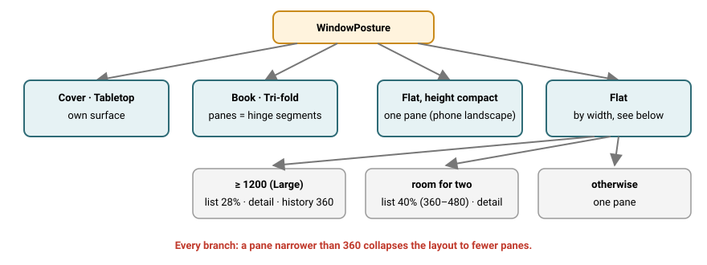
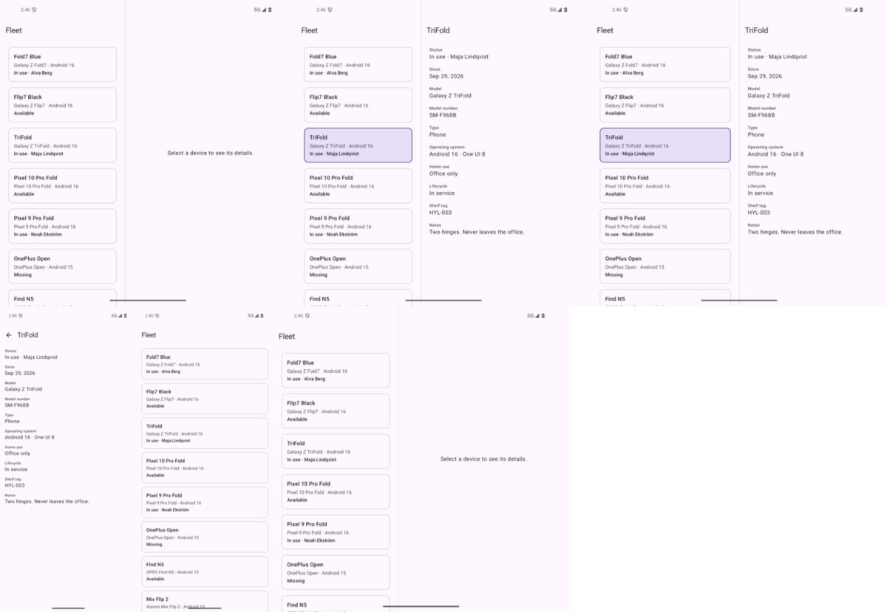
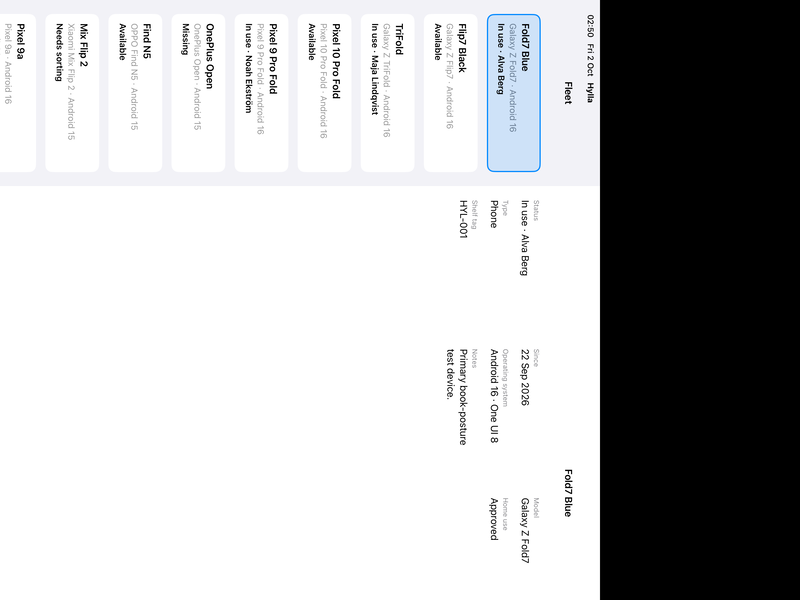

# 05 — Two panes, split at the hinge

**Tag:** `chapter-05`

## The concept

When the window has room for two legible panes, the fleet and the selected device sit side by
side. Where the panes go is a pure function of the posture, `PaneLayout.compute(posture)`, and
the rule has three branches:

| Posture | Panes |
| --- | --- |
| Book (one separating vertical hinge) | The two **segments** the hinge leaves: the split is at the hinge, not at 40% or 50%. |
| Flat, height not compact | List = 40% of the width, clamped to 360–480; detail = the rest. |
| Cover, tabletop, compact height | One pane. Cover and tabletop get their own surfaces in chapters 7 and 8. |

In every branch, **a pane narrower than 360 (the minimum legible width from chapter 4)
collapses the layout to one pane.** The layout table says *Medium → two panes*. A medium window
600–719 wide cannot hold two 360 panes, so it gets one. The minimum wins over the table, because
a pane too narrow to read is worse than a pane reached by navigation.

A phone in landscape is `Expanded` width but `Compact` height, so it stays one pane. This is the
second half of *landscape is not width*: the split reads both classes.

## In pictures



*PaneLayout's rules. A pane below the legible minimum always collapses the layout.*



*fold_api36: flat split with placeholder, selection, book posture split at the hinge, closed (detail alone), back, reopened.*



*iPad Pro portrait: NavigationSplitView with the selected tile marked.*

## Before

Chapter 4's single pane gained columns, but on an unfolded foldable the detail was still a
screen away. In book posture the content ran straight across the crease.

## Android: a scene strategy

The back stack does not change. It is `[Fleet]` or `[Fleet, Device]` in every posture.
`TwoPaneSceneStrategy` decides how to *show* it:

- **No room** (`layout.paneCount < 2`): return `null`, and Navigation 3 falls back to one entry
  at a time.
- **Two panes:**
  - The list entry renders in the first pane.
  - The top detail entry renders in the second, or a *Select a device* placeholder if there is
    none.
  - An occluding hinge leaves its gap empty; a seamless hinge or a flat split gets a divider.

Entries say which pane they belong in through `NavEntry.metadata` (`PaneRole.List`,
`PaneRole.Detail`), so the strategy never inspects route types.

**Folding never loses state.** Open → book → closed → open on `fold_api36` keeps the selected
device throughout. Closed, it is the top entry and shows alone with an up button. Open, it shows
beside the list. Back from a lone detail returns to the fleet; reopening then shows the
placeholder.

**Selecting replaces, it does not stack.** Tapping a second device while one is shown replaces
the top `DeviceRoute`. Otherwise back would step through every device you had glanced at.

**Up hides beside the list.** `LocalInMultiPane` is provided by the scene. The detail drops its
up button when it is true. System back still clears the selection.

## iOS: one selection, two presentations

`selection: Device.ID?` is the only state.

- **One pane:** a `NavigationStack` whose path is derived from it, `selection.map { [$0] } ?? []`.
- **Two panes:** a `NavigationSplitView` showing it in the detail column.

Switching between the two, by resizing in Stage Manager or rotating an iPad, keeps the selection.

`NavigationSplitView` is used only when `PaneLayout` says two panes. It is not left to collapse
on its own, because it collapses on the *system* size class, and a regular-width window can still
be too narrow for two 360 pt panes. The list column gets `PaneLayout`'s width through
`navigationSplitViewColumnWidth(min:ideal:max:)`, and the sidebar toggle is removed: hiding the
list is not a state this layout has.

iOS reports no hinges, so only the flat rule applies there. The book rule is still unit tested on
iOS with synthetic folds, so the two implementations cannot drift.

## Never stretch, again

The panes take the grid from chapter 4 with them. The list pane on a flat foldable is 360 dp, so
it holds one column. The same list alone on that screen held two. The detail pane computes its
own column count from its own width.

## Accessibility

- The selected tile carries the selected state: `semantics { selected = true }` on Android and
  `.isSelected` on iOS. A screen reader says which device the detail belongs to.
- Pane order is list, then detail, in reading order on both platforms.
- Chapter 18 adds keyboard focus traversal between the panes.

## Observed

| Device | State | Panes |
| --- | --- | --- |
| `fold_api36` | Opened, flat | 360 \| 492, placeholder until a device is chosen |
| `fold_api36` | Half-opened, book | 426 \| 426, at the hinge |
| `fold_api36` | Closed | One pane, detail kept, up button shown |
| `pixel6pro_api35` | Portrait and landscape | One pane |
| iPad Pro 13" | Portrait | 413 \| 619 |
| iPad Pro 13" | Landscape | 480 \| 896, list in one column |
| iPhone 18 Pro | Portrait and landscape | One pane |

## Verify

```sh
cd android && ./gradlew :app:testDebugUnitTest     # 45 unit tests
cd ios && xcodebuild -project Hylla.xcodeproj -scheme Hylla \
  -destination 'platform=iOS Simulator,name=iPad Pro 13-inch (M5),OS=27.2' test
```

The UI tests adapt to the device they run on:

- The back test is skipped where there is no back (two panes).
- The two-pane test is skipped where there is one pane.
- The landscape test accepts either *gained a column* or *gained a pane*, never a stretched column.
