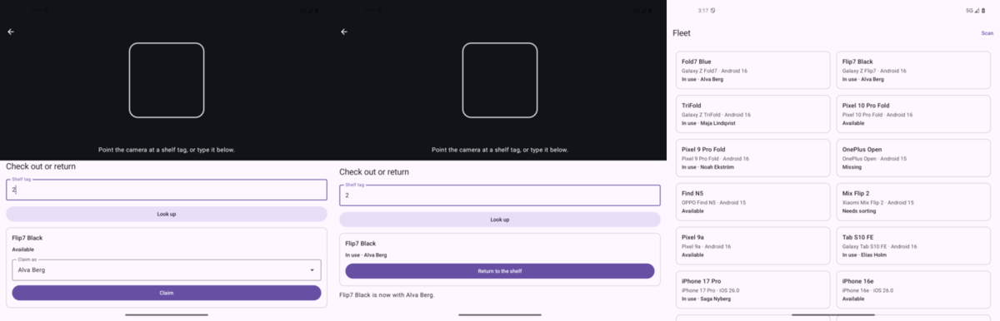
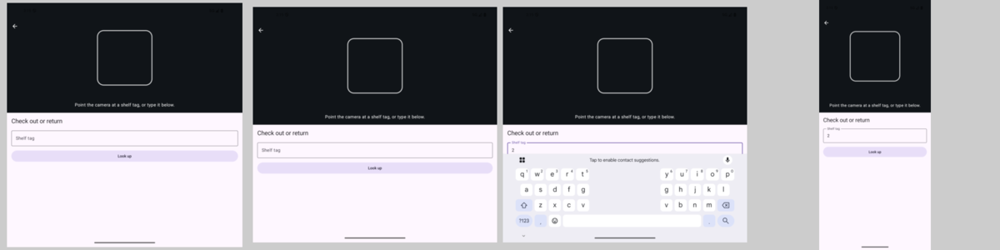

# 07 — Tabletop posture: scanner above, form below

**Tag:** `chapter-07`

## The concept

Half-fold a foldable and stand it on its lower half, and you have a camera stand. At the shelf
that is exactly the posture you want:

- the top half faces the shelf tags, with the viewfinder;
- the bottom half lies on the shelf in the thumb zone, with the claim form;
- nothing sits on the crease.

`ScanLayout.compute(posture)` places the two areas, in window coordinates:

| Posture | Viewfinder | Controls |
| --- | --- | --- |
| Tabletop (horizontal separating hinge) | First segment, above the crease | Last segment, below it |
| Compact height (phone landscape) | Left half | Right half |
| Otherwise | Top 45% | The rest |

In tabletop, the split comes from the hinge's bounds, like chapter 5's book posture:

- A crease at 500 gives a 500-tall viewfinder, not 45%.
- An occluding crease is left empty.
- Folds stay a list: with more than one horizontal hinge, the viewfinder takes the first segment
  and the controls the last.

## In pictures



*Tabletop: viewfinder above the crease, claim form below; claimed, and the fleet updated.*



*Before the fix: in tabletop the keyboard covered Look up.*


*Later fix from real hardware: with the keyboard up, the viewfinder shrinks to a strip.*

## A store, finally

Claiming needs somewhere to write. `FleetStore` holds the fleet and applies two changes:

- **Claim:** status becomes `inUse`, `currentUser` and `since` are set, and an open assignment is added.
- **Return:** status becomes `available`, and the open assignment is closed today.

Each change is atomic. One that does not apply, such as claiming a held device or returning one
nobody holds, fails and leaves the fleet exactly as it was. The tests check after every change
that the fixture invariants from chapters 1 and 6 still hold.

**Where it lives decides whether it survives a fold.**

- **Android:** the store is owned by `HyllaApplication`, not the Activity. Folding, rotating and
  density changes recreate the Activity, and a store held in `remember` would have lost every
  claim made before the fold.
- **iOS:** the store is `@Observable` and held in `@State` on the `App`, because no posture
  change recreates the scene.

The store is in memory, so a killed process starts from the fixture again. Chapter 16 makes it
persistent.

## The scan screen

Typing the shelf tag works on every device and does not need a camera. `ShelfTag.parse` accepts
the loose spellings people type (`hyl-2`, `HYL2`, `2`) and resolves them to `HYL-002`. The camera
arrives with runtime permissions in chapter 14. The typed path stays after that: it is the
accessible fallback, and the one that works when the tag is damaged.

| | Android | iOS |
| --- | --- | --- |
| Opened from | *Scan* in the fleet's top app bar | *Scan* in the fleet's toolbar |
| Presented as | `ScanRoute`, a back-stack entry with no pane role, so the scene strategy leaves it full-window | `fullScreenCover`, a modal task |
| Placement | `offset` and `size` at `ScanLayout`'s window-coordinate bounds | `frame(height:)` / `frame(width:)` from the same bounds, viewfinder under the safe area |
| Who claims | `ExposedDropdownMenuBox` of people | `Picker("Claim as")` |

Chapter 10 replaces the person dropdown with the full person picker.

## What went wrong on the way

**The keyboard ate the form.** In tabletop the controls are the lower half of the window, and
the on-screen keyboard is about that tall. The first build left the *Look up* button under the
keyboard. Two fixes:

- `imePadding()` on the controls, so the scroll viewport shrinks above the keyboard.
- Putting the keyboard away after a look-up, so the device that was found is visible.

iOS avoids the keyboard in a `ScrollView` by itself; the field's focus is cleared on submit for
the same reason.

**Instrumented tests "failed" with no device.** The phone emulator used so far had been closed,
and `connectedAndroidTest` with `ANDROID_SERIAL` set to it exits non-zero without running
anything. The suite was rerun on `fold_api36` in the closed state (one pane, 443 dp): 5 of 5 pass.

## Observed

| Device | State | Viewfinder bottom |
| --- | --- | --- |
| `fold_api36` | Opened, flat portrait, 852 × 883 dp | 397 dp, 45% of the height |
| `fold_api36` | Half-opened, rotated: tabletop, 883 × 852 dp | 426 dp, exactly the crease |
| `fold_api36` | Closed | Stacked; the typed tag survived the fold |

In tabletop, typing `2` and claiming as Alva Berg showed *Flip7 Black is now with Alva Berg.*
The fleet then listed *Flip7 Black · In use · Alva Berg*.

iOS has no hinges, so iOS tabletop exists only in unit tests with a synthetic crease. The scan UI
tests (claim by typed tag, return) run on the iPhone 18 Pro and the iPad Pro 13".

## Verify

```sh
cd android && ./gradlew :app:testDebugUnitTest      # 65 unit tests
adb shell cmd device_state state 1                  # HALF_OPENED
adb shell settings put system user_rotation 1       # stand it on its side: tabletop
cd ios && xcodebuild -project Hylla.xcodeproj -scheme Hylla \
  -destination 'platform=iOS Simulator,name=iPhone 18 Pro,OS=27.2' test
```
