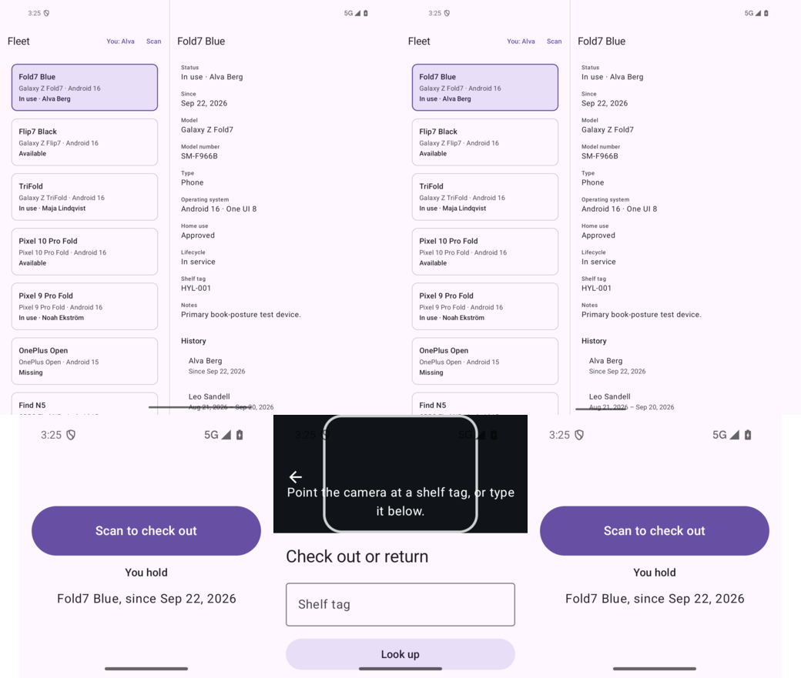
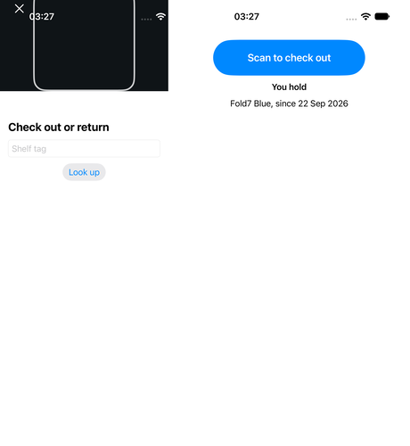

# 08 — Cover display surface

**Tag:** `chapter-08`

## The concept

You are at the shelf with a flip phone shut. Its outer screen is about 330 × 350 dp. The app
shows exactly two things there:

- **One action: scan to check out.** A full-width button at least 56–64 tall.
- **The devices you hold right now**, each with the date you took it.

There is no navigation chrome: no top bar, no tabs, no list. There is no room for it, and
nothing else is worth doing with the phone closed.

## In pictures



*Opened with Fold7 selected; shrunk to a cover-sized window (one action, the devices you hold); scanning from the cover; reopened where it was.*



*iOS cover surface through the debug window override, and the scanner from it.*

## Deciding it from the window

`Posture.Cover` comes from chapter 2: a window narrower than 480 with a compact height. It is
decided from the window alone, so the same surface appears in three places:

- on a flip phone's outer screen;
- in a small split-screen window on Android;
- in a narrow Slide Over or a small Stage Manager window on iPad.

That is deliberate. The window is the only input, and a 330-wide window cannot hold the fleet
either.

**Not every outer screen is a cover surface.** The iPhone Duo's cover screen is 466 × 678 pt:
narrow, but not short. It gets the ordinary phone layout, the fleet and its detail, because it has
room for them. The glanceable surface is for windows that do not.

**The cover replaces the UI, not the state.**

- **Android:** `HyllaNavigation` shows `CoverSurface` instead of the `NavDisplay` while the posture
  is `Cover`. The back stack underneath is untouched.
- **iOS:** `ContentView` shows `CoverView` instead of the stack or split view. `selection` is
  untouched.

Opening the phone again lands exactly where you were. On `fold_api36`: Fold7 Blue selected in
two panes, shrink the window to cover size, open it again, and Fold7 Blue is still selected.

Scanning from the cover pushes the scanner as usual. On Android, the cover is skipped while the
scanner is the top entry, so the scanner can run on the cover screen itself.

## Who you are

"The devices you hold" needs to know who is holding this phone. That is a **local preference**,
not an account:

- Android: `MeStore` over `SharedPreferences`.
- iOS: `@AppStorage("me")`.

It is chosen from *You* in the fleet's top bar and is never synced. It is also the default person
on the scanner's *Claim as*. Chapter 10 replaces the simple chooser with the full person picker.

## What went wrong on the way

**A 200 dp aiming guide on a 150 dp viewfinder.** On the cover, the scanner's viewfinder is 45%
of 350, about 157 tall. The fixed 200 guide from chapter 7 overflowed it and ran over the hint
and the back button. The guide is now 55% of the viewfinder's shorter side, capped at 200, and
the hint only shows when the viewfinder is at least 280 tall.

- Android sizes it in a `BoxWithConstraints` around the viewfinder.
- iOS first tried `containerRelativeFrame`. That measured the *screen*, because the nearest
  container was the full-screen cover, not the viewfinder. The viewfinder now measures itself
  with `onGeometryChange`.

**The iOS viewfinder was taller than asked.** `ScanLayout` works in window coordinates, while
a `VStack` lays out inside the safe area. The viewfinder extends under the status bar, so its
visible height was the layout height *plus* the top inset. The inset is now taken off the
layout size.

**`ImageRenderer` renders a blank.** The first iOS check rendered `CoverView` to an image in a
unit test. The image was white: `ImageRenderer` does not draw `ScrollView` or buttons. The test
was deleted rather than kept, because a test that passes on a blank image proves nothing.

## Testing a window this small

| | Command |
| --- | --- |
| Android | `adb shell wm size 800x830` on `fold_api36` (density 2.4375): 328 × 340 dp |
| iOS | Debug builds read `-HyllaWindowOverride 330x350` and lay the app out as if the window were that size |

The iOS override is the counterpart of `wm size`. Simulators cannot make a cover-sized window from
a script, and the UI tests need one. The override is compiled out of release builds.

## Accessibility

- *You hold* is a heading; each held device is one line of text.
- The scan button is the first focusable element on both platforms.
- *Who is holding this phone?* is a radio group on Android (`selectableGroup`, `Role.RadioButton`,
  48 dp rows) and a `Picker` in a menu on iOS.

## Verify

```sh
adb shell wm size 800x830     # cover-sized window on fold_api36
adb shell wm size reset
cd ios && xcodebuild -project Hylla.xcodeproj -scheme Hylla \
  -destination 'platform=iOS Simulator,name=iPhone 18 Pro,OS=27.2' -only-testing:HyllaUITests/CoverUITests test
```

Not verified on hardware: a real flip phone's outer screen. No flip-phone emulator image is
installed.
