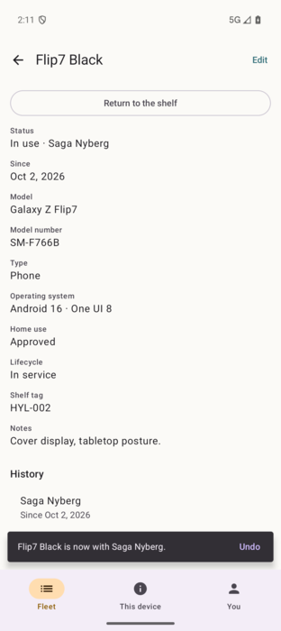

# 11 — Snackbars, toasts and transient feedback

**Tag:** `chapter-11`

## The concept

You claimed a device. The app should say so briefly, without stopping you, and let you take it
back if you tapped the wrong tile. Where that message lives is a platform decision, and the two
platforms answer it differently.

## In pictures



*Android: a claim confirms in a snackbar above the navigation bar, with Undo.*

## Android: snackbar, toast, or nothing

| Situation | Choice | Why |
| --- | --- | --- |
| A change you just made in the app: claim, return, edit | **Snackbar** with *Undo* | The app is on screen and the message is about it. A snackbar lives in the app's UI, can carry an action, and sits above the navigation bar. |
| Feedback with no app UI to put it in, such as an action taken from a notification | **Toast** | Arrives with the notification actions in chapter 15. There is no window to host a snackbar. |
| Copying a shelf tag (long-press a tile) | **Nothing** | Since Android 13 the system shows its own confirmation for clipboard writes. A second one from the app would be noise. |

There is one `SnackbarHostState` for the whole shell, inside the navigation chrome. A snackbar
never covers the bottom bar, and it stays put when a pane changes underneath it, for example when
the detail pane swaps to another device.

With TalkBack on, Material 3 holds a snackbar on screen for the duration the system's
accessibility settings recommend, so a snackbar with an action can be reached before it goes.

## iOS: a banner, a haptic and an announcement

iOS has no snackbar and no toast, and Apple's guidance avoids pop-up toasts. The platform-correct
answer is a short banner tied to what you just did:

- **The banner** sits above the tab bar, with *Undo* when the change can be undone.
- **A success haptic** comes from `.sensoryFeedback(.success, trigger:)`.
- **A VoiceOver announcement** comes from `AccessibilityNotification.Announcement`. A banner that
  VoiceOver users cannot perceive is not feedback.
- **The duration depends on VoiceOver:** 4 seconds without it, 10 seconds while it is running.

## Undo

Both stores gained one level of undo. The store keeps the fleet it replaced on each successful
change and restores it on request. A failed change does not replace it. This is for the *wrong
device* moment right after a tap, not a history. Chapter 16 turns undo into a compensating change
in the sync queue.

**Assign once, or undo restores half a change.** On iOS the store records the previous fleet in
`willSet`. The first `claim` changed the fleet in four steps (status, holder, since, assignment),
so `willSet` fired four times and *undo* would have restored a state three-quarters through the
claim. Every change now builds the next fleet and assigns it once.

## Verify

```sh
ANDROID_SERIAL=emulator-5556 ./gradlew :app:connectedDebugAndroidTest   # FeedbackTest
cd ios && xcodebuild -project Hylla.xcodeproj -scheme Hylla \
  -destination 'platform=iOS Simulator,name=iPhone 18 Pro,OS=27.2' \
  -only-testing:HyllaUITests/SheetsUITests/testAClaimShowsABannerThatCanUndoIt test
```

Both tests claim a device from its detail, see the confirmation, tap *Undo*, and check that the
device is available again.
