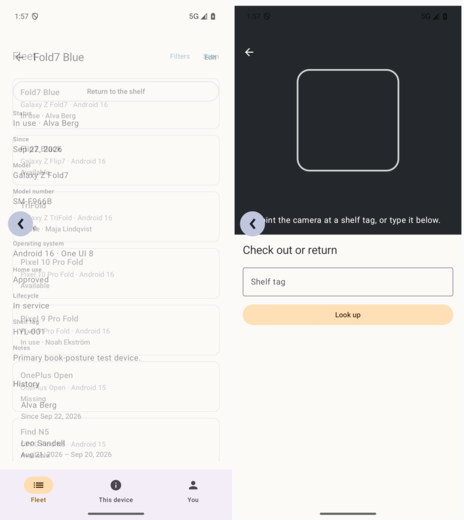

# 12 — Back navigation and predictive back

**Tag:** `chapter-12`

## The concept

Back is the most used gesture in the app, and an adaptive layout changes what it means:

- **One pane:** back pops the detail and shows the fleet.
- **Two or three panes:** back clears the selection. The list stays where it is and the detail
  pane shows its placeholder.
- **Another top-level destination** (*This device*, *You*): back returns to *Fleet* before it
  leaves the app.
- **A modal** (scanner, sheet): back leaves the modal and nothing else.

Because the back stack has one shape in every posture (`[Fleet]` or `[Fleet, Device]`, from
chapter 5), these are not separate code paths. Back always removes the top entry, and the posture
decides only what that looks like.

## In pictures



*Mid-gesture: the detail shrinks and fades over the fleet (left); the scanner follows the gesture (right).*

## Android: predictive back

**Predictive back** lets you see where back goes before you commit. Dragging from the edge
previews the destination, and letting go either completes or cancels.

| Where | How |
| --- | --- |
| Fleet and detail | `NavDisplay(predictivePopTransitionSpec = …)`: the current scene shrinks to 92% and fades while the destination grows in. |
| Scanner | It is drawn outside `NavDisplay`, so a `PredictiveBackHandler` collects the gesture's progress and scales the scanner with it. It only leaves on release; a cancelled gesture puts it back. |
| Edit sheet | `ModalBottomSheet` follows the gesture natively. Chapter 10's discard check still runs when the gesture completes. |
| Other destinations | `BackHandler(enabled = tab != Fleet)` returns to the fleet. |

Predictive back is on by default for apps targeting SDK 36 and up. The manifest still declares
`android:enableOnBackInvokedCallback="true"`, so the behaviour does not depend on remembering a
default.

The gesture was checked mid-flight on `fold_api36`: `adb shell input motionevent` presses at the
edge, moves part of the way, takes a screenshot and moves back before lifting. The screenshots
show the detail fading over the fleet, and the scanner following the gesture.

## iOS: the system's gestures

- **Navigation stack:** the edge swipe (interactive pop) comes with `NavigationStack`. Nothing
  overrides the back button, so it keeps working.
- **Sheets:** they swipe down to dismiss, except an edit with unsaved changes, which is
  `interactiveDismissDisabled` (chapter 10).
- **The scanner:** it is a `fullScreenCover`, which has **no** dismiss gesture. Its *Close* button
  is the way out, and it takes `.keyboardShortcut(.cancelAction)`, so **Escape** on an iPad
  keyboard closes it.

## Verify

```sh
ANDROID_SERIAL=emulator-5556 ./gradlew :app:connectedDebugAndroidTest
#   backFromTheScannerReturnsToTheFleet, backFromAnotherDestinationReturnsToTheFleetFirst,
#   systemBackReturnsToTheFleet
cd ios && xcodebuild -project Hylla.xcodeproj -scheme Hylla \
  -destination 'platform=iOS Simulator,name=iPhone 18 Pro,OS=27.2' \
  -only-testing:HyllaUITests/FleetNavigationUITests/testEdgeSwipeGoesBack test
```
