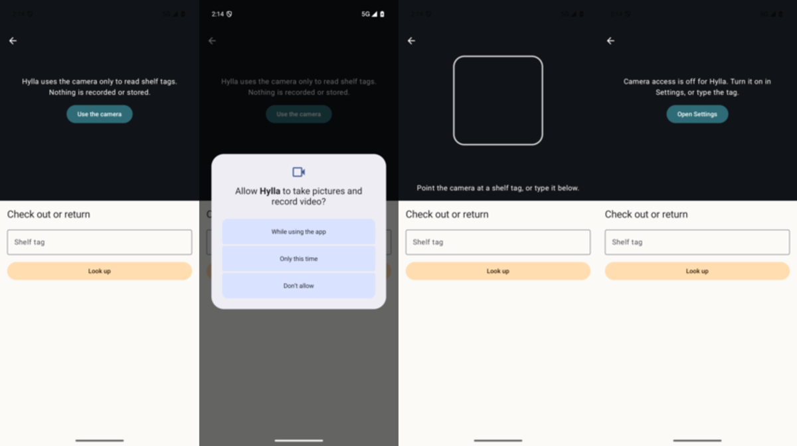
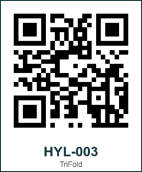

# 14 — Permissions: camera and notifications

**Tag:** `chapter-14`

## The concept

The scanner can now use the camera, and the app can ask to send notifications. Both are runtime
permissions, and the rule for both is the same: **ask at the moment the person shows they want the
thing, with the reason first, never at launch.**

- **Camera:** asked on the scanner, when *Use the camera* is tapped.
- **Notifications:** asked on *You*, when *Notify me about devices* is turned on.

Opening the app asks for nothing. Typing a tag keeps working without either permission.

## In pictures



*Android: the reason first; the system dialog; granted (the emulator's camera shows no scene); blocked, with Open Settings.*



*A shelf tag. The QR code holds the device link, so the scanner, the system camera and a typed tag all reach the same device.*

## Four states, two platforms

| State | Meaning | What the app shows |
| --- | --- | --- |
| Not asked | Never asked | The reason, and a button that asks |
| Granted | | The camera, or the switch on |
| Denied (Android only) | Denied once; the system will ask again | The reason again, and the button |
| Blocked | Denied for good, or off in Settings | Why it is off, and *Open Settings* |

- **Android** cannot tell *never asked* from *blocked*: both report
  `shouldShowRequestPermissionRationale == false`. `PermissionState.of` tells them apart with an
  *asked before* flag that the app keeps, and the unit tests pin that down.
- **iOS** reports the state directly, through `AVCaptureDevice.authorizationStatus` and
  `UNNotificationSettings.authorizationStatus`, so there is no flag to keep. There is also no
  *denied once*: after the first answer only Settings can change it.

Both re-read the state when the app returns to the foreground, because the person may have just
changed it in Settings.

## The camera

| | Android | iOS |
| --- | --- | --- |
| Preview | CameraX `Preview` into `CameraXViewfinder` (camera-compose) | VisionKit `DataScannerViewController` |
| Reading codes | ML Kit barcode scanning on CameraX `ImageAnalysis` frames, QR only | `recognizedDataTypes: [.barcode(symbologies: [.qr])]` |
| Lifetime | Bound to the lifecycle: stops off screen and in the background | Started in `makeUIViewController`, stopped in `dismantle` |
| No camera | `uses-feature camera.any required=false`; the typed tag remains | `DataScannerViewController.isSupported` false on the simulator; it says so and keeps the typed tag |

**Codes hold links.** A shelf tag's QR code holds `hylla://device/HYL-003`, the chapter 13 link.
`ScannedCode.parse` reads a link first and falls back to a bare tag. One format serves the scanner,
the system camera ("open in Hylla") and a printed label people can read.

`docs/assets/shelf-tags/` has a tag per fixture device and a printable sheet. They were generated
with Core Image's QR generator and checked by decoding them back.

Scanning the same tag twice in a row is ignored, and a new one gives a confirming haptic.

## Not verified

- **QR codes read by a real camera.** Neither the emulator, whose camera shows no scene, nor the
  iOS simulator, which has no data scanner, can read a code. The permission flows are verified on
  both. The read itself waits for a run on hardware with the printed tags.

## Verify

```sh
adb shell pm revoke com.umain.hylla android.permission.CAMERA
adb shell pm set-permission-flags com.umain.hylla android.permission.CAMERA user-fixed   # blocked
cd ios && xcodebuild -project Hylla.xcodeproj -scheme Hylla \
  -destination 'platform=iOS Simulator,name=iPhone 18 Pro,OS=27.2' -only-testing:HyllaUITests/PermissionUITests test
```
