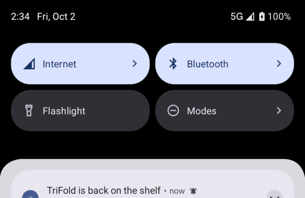

# 15 — Notifications

**Tag:** `chapter-15`

## The concept

Two notifications, each worth interrupting someone for:

| Notification | When | Action |
| --- | --- | --- |
| **Overdue** | A device the phone's holder has kept 14 days or more | *Return*, without opening the app |
| **Back on the shelf** | A device the holder said they were waiting for becomes claimable | — |

Tapping either opens its device through the chapter 13 link, `hylla://device/HYL-NNN`. A
notification needs no navigation code of its own: it is just another way to deliver a link.

Nothing is posted unless the holder turned notifications on in *You* (chapter 14), *and* the
system permission is granted. Those are two different facts: the permission says Hylla *may*
post, the switch says the person *wants* it to.

## In pictures

*Android: waiting for the TriFold, then returning it, posts "back on the shelf" on its own channel.*

## The rules, kept pure

`Notices` holds the rules, apart from how notifications are posted, so they are unit tested:

- **`overdue(fleet, me, today)`:** the holder's in-use devices held 14 days or more, longest first.
  It is empty with no holder chosen.
- **`overdueOn(device)`:** the date to schedule for: `since` + 14 days.
- **`backOnTheShelf(before, after, watched)`:** watched devices that could not be taken before and
  can be now. *Claimable* means available **and** in service, so a decommissioned device returned
  to the shelf does not announce itself.

## Android

| Piece | What it does |
| --- | --- |
| Channels | *Overdue devices* (default importance) and *Back on the shelf* (high: the reason to wait was to hear about it). Created at startup. |
| `OverdueWorker` | A daily periodic `CoroutineWorker`, `enqueueUniquePeriodicWork(KEEP)`, so restarts do not stack copies. |
| Watch list | *Notify me when it is back* on the detail of a device nobody can take now. Stored locally. |
| Store observer | The application collects the store. Each change is compared with the one before, a watched device that became claimable is announced, and it leaves the watch list. |
| `ReturnReceiver` | The overdue notification's *Return* action. It returns the device and confirms in a **toast**, the one toast in the app. The app's UI is not on screen, so there is no snackbar host to confirm in (chapter 11). |

**Testing a periodic worker.** `adb shell cmd jobscheduler run -f` starts the job, but WorkManager
refuses to run a periodic worker before its period: *"Delaying execution … because it is being
executed before schedule."* The instrumented test runs the worker directly with `work-testing`'s
`TestListenableWorkerBuilder` and reads `NotificationManager.activeNotifications`:

- Noah holds the Mac mini and the Pixel 9 Pro Fold, so both are overdue.
- Returning a watched TriFold announces it and removes it from the watch list.
- With the switch off, nothing is posted.

## iOS

| Piece | What it does |
| --- | --- |
| `Notifier.scheduleOverdue` | One request per device the holder has, `UNCalendarNotificationTrigger` at 09:00 on the due day, or a one-second trigger if that day has passed. It removes the pending `overdue-*` requests first, so it can be called on every change. |
| `RootView` | `.task(id:)` reschedules whenever the fleet, the holder or the switch changes. `.onChange(of: store.fleet)` compares before and after for the watch list. |
| `NotificationDelegate` | The `UNUserNotificationCenterDelegate`. A tap opens the notification's link with `UIApplication.open`, which arrives at chapter 13's `onOpenURL`. The *Return to the shelf* action returns the device without opening the app, so there is no toast to show on iOS. While Hylla is in front, notifications show as banners. |
| Watch list | *Notify me when it is back* on the detail, kept in `AppStorage`. |

The notifier takes the notification center through a small protocol, `NotificationScheduling`. Its
unit tests use a recording center and check that:

- an overdue request is for 09:00 on 6 October, carries the device link and the Return category;
- already-overdue devices fire at once;
- rescheduling for a different holder replaces the old schedule.

`NotificationUITests` waits for the TriFold, returns it, and finds *TriFold is back on the shelf*
on the springboard.

The delegate's two callbacks are `nonisolated`. `UNNotification` and `UNNotificationResponse` are
not `Sendable`, so the link is read where they arrive and only a plain `String` crosses to the main
actor.

## Until chapter 16

The store is still in memory. A worker that runs in a fresh process sees the fixture, not the
claims made before the process ended, and a device returned on *another* phone is not seen at all.
Chapter 16 gives the store persistence and sync, and the same observer then announces returns that
arrive by sync.
