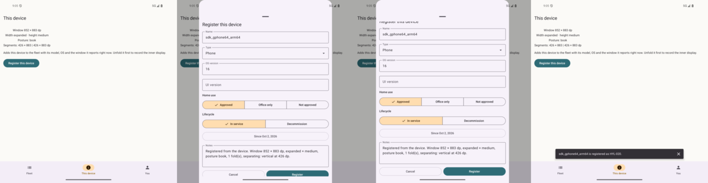

# 17 — Register this device

**Tag:** `chapter-17`

## The concept

The loop that makes Hylla self-demonstrating: the app adds the device it is running on to the
fleet, and the record it drafts is written by the very APIs the codelab teaches. Unfold a Fold in
book posture, open *This device*, tap *Register this device*, and the notes say so:

> Registered from the device. Window 852 × 883 dp, expanded × medium, posture book, 1 fold(s),
> separating: vertical at 426 dp.

## In pictures

*fold_api36 in book posture: the readout, the drafted record in the full-height sheet, and the confirmation.*

## The draft

`Registration.draft(build, posture, fleet, today)` is pure and unit tested. It turns what the
device says about itself into a `Device`:

| Field | Android | iOS |
| --- | --- | --- |
| Shelf tag | The first free `HYL-NNN` | Same |
| Name | The name given in Settings (`Settings.Global.DEVICE_NAME`), else the model | The model; iOS no longer exposes the user-assigned name without an entitlement |
| Model name / number | `Build.MANUFACTURER` + `Build.MODEL` / `Build.MODEL` | `UIDevice.model` / the hardware identifier (`utsname.machine`, e.g. `iPhone18,1`) |
| OS version | `Build.VERSION.RELEASE` | `UIDevice.systemVersion` |
| UI version | The skin by manufacturer (Samsung → *One UI*), **without** a version | `nil`: iOS has no skin |
| Type / platform | Phone / Android | Phone or tablet from the idiom / iOS or iPadOS |
| Notes | The window from `WindowPosture`: size, classes, posture, every separating hinge | The window from the same model |

**No skin version.** Samsung reports One UI's version in a system property
(`ro.build.version.oneui`, 90000 on the SM-F971B). Reading system properties is not a public API,
so the draft names the skin and leaves the version to be typed. Everything in the draft is editable
before it is saved.

**The window is the window at registration.** A Fold registered while folded records its cover
screen. *This device* says to unfold it first, and the notes say which window was recorded, so the
record cannot pretend to be more than it is.

## Saving it

The draft opens in the chapter 10 edit sheet at full height, titled *Register this device*, with
*Register* in place of *Save*. *Register* is enabled from the start, because a draft is worth
saving as it is.

`FleetStore.register` adds the device, journals a `register` operation (chapter 16) and runs the
fleet's validation, so a second registration under a tag that is now taken fails.
