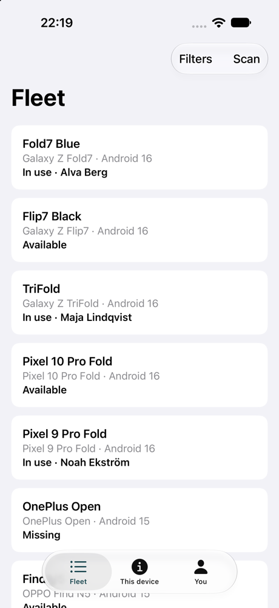

# 18 — Accessibility pass

**Tag:** `chapter-18`

## The concept

Accessibility has been a requirement in every chapter: one element per row and per field
(chapter 3), largest text at every breakpoint (3, 4, 5), selection state (5), live regions and
announcements (2, 11), radio groups and 48 dp rows (8, 10). This chapter adds what only shows up
once the app has several panes and a keyboard, and puts **automated audits** over every screen so
regressions fail a test instead of waiting for someone to notice.

## Panes a screen reader can name

With two or three panes, choosing a device changes a pane *the reader is not in*. It has to be
told.

| | Android | iOS |
| --- | --- | --- |
| Name each pane | `semantics { paneTitle = … }`: *Fleet*, the device's name, *History* | Each split-view column has its own navigation title |
| Announce a change | The detail's pane title changes with the device, and TalkBack announces a changed pane title | `.onChange(of: selection)` posts *Showing Fold7 Blue* when the detail sits beside the list |

## Keyboard and D-pad

Large screens get keyboards: a Fold with a Bluetooth keyboard, an iPad with a Magic Keyboard.

| | Android | iOS |
| --- | --- | --- |
| Between panes | Each pane is a `focusGroup()`: Tab moves pane to pane, arrow keys move within one | Split-view columns are focus sections; Tab moves between them |
| Inside the grid | Compose's two-dimensional focus traversal follows the grid | The same, through `LazyVGrid` |
| Filters | **Ctrl+F** (`onPreviewKeyEvent`) | **⌘F** (`.keyboardShortcut("f")`) |
| Scanner | — | **⌘K** opens it, **Escape** closes it (chapter 12) |
| Back | Escape and the D-pad's back key are system back | Escape closes sheets and the scanner |

## Automated audits

**Android: the Accessibility Test Framework.** `AccessibilityChecksTest` enables Compose's
`enableAccessibilityChecks()` (from `ui-test-junit4-accessibility`) and runs the checks on the
fleet, a detail, the scanner, *You* and *This device*. The checks cover touch target size,
contrast, missing labels and duplicate descriptions, and every one passes.

**Checking the checker.** A suite of checks that never fails might not be checking anything. Two
deliberate breaks:

- **Shrinking *Scan* to 20 dp did not fail.** Material 3 keeps a 48 dp touch target
  (`minimumInteractiveComponentSize`) whatever the visual size, so there was nothing to catch. A
  useful lesson in itself: the component library already guards touch targets.
- **Removing the back button's label failed the detail test, as it should.**

**iOS: `performAccessibilityAudit()`.** `AccessibilityAuditUITests` audits the same screens plus
the filter sheet. Its first run failed with three real findings, each reported with its element:

| Finding | Cause | Fix |
| --- | --- | --- |
| *Contrast failed — Clear* | A disabled *Clear* in the filter sheet, drawn in light grey | *Clear* is shown only when there is something to clear |
| *Contrast failed — Filters* | The brand teal `#2E6B76` on the translucent toolbar | Light-mode accent darkened to `#1D4B54` |
| *Contrast nearly passed* | Secondary-colour text on *This device*, and the footnote under *Notifications* on *You* | Primary colour |

**When the audit is wrong.** After those fixes, the contrast findings stopped making sense. On
the iOS 27.2 simulator they moved from run to run: the *Filters* button, then *Scan* beside it,
then an element with no frame at all. And they contradicted the pixels: in a screenshot *Filters*
measures **19.7:1**, black on near-white glass.

*The toolbar the audit flagged, on Liquid Glass: black text on near-white glass.*

Two checks are therefore left out of the audit, each for a stated reason, in the test file:

- **Contrast.** Over Liquid Glass it is unstable and contradicts measurement. Its real findings
  were fixed above.
- **Dynamic Type.** It flags the system's own *Done* bar button, which stops growing by design
  and offers the Large Content Viewer instead. It also flags text that the `AtLargestDynamicType`
  tests show growing to AccessibilityXXXL. Those tests are the Dynamic Type check.

Every other check still runs and fails the test: element detection, hit regions, descriptions,
clipped text and traits. One of them caught the filter sheet's first header sitting under the
glass bar at half height (*Text clipped — Platform*), so the sheet is audited at full height.

**The lesson:** treat an audit as a lead, not a verdict. Fix what it finds when the cause is real.
Measure when it disagrees with the screen. Write down why a check is off, next to the line that
turns it off.

## Text size at every breakpoint

The largest text sizes are covered by tests at more than one window size:

- **Android:** 200% font scale on the folded and the unfolded `fold_api36` (chapters 2–4).
- **iOS:** `AccessibilityXXXL` on the iPhone and the iPad (`testFleetAndDetailAtLargestDynamicType`
  runs on both).

At those sizes:

- grids fall back to fewer, wider columns (chapter 4);
- detail fields put the label above the value (chapter 3);
- no container has a fixed height around text: the scan controls, sheets and the summary all
  scroll.

## Not verified

- **A full walk with TalkBack and VoiceOver running.** The tests check what the readers are
  given (nodes, labels, pane titles, announcements), not how it is spoken.
- **Keyboard operation on hardware.** The keyboard paths above are built on platform focus APIs
  and were checked in code and emulator key events, not with a physical keyboard on a Fold or iPad.
