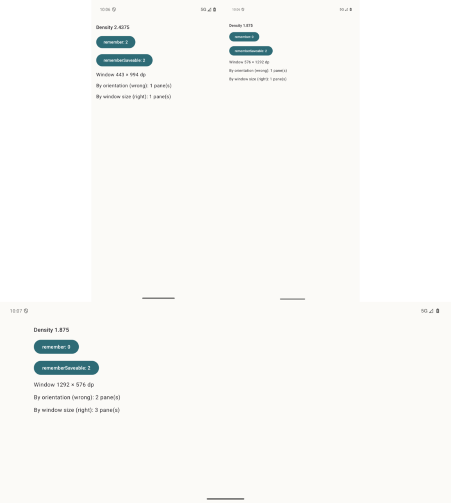

# 19 — Anti-patterns

**Tag:** `chapter-19`

## The concept

Four mistakes, each seen producing a real rendering bug on real hardware. Showing only the correct
code teaches nothing about why it is correct, so each one is written here **on purpose**, in
debug-only code, with a test that shows it giving the wrong layout next to the right rule on the
same input.

The tests *pass* because the bug is real. If one ever fails, the anti-pattern has stopped being
one, and the chapter needs rewriting.

| | Android | iOS |
| --- | --- | --- |
| The mistakes | `src/debug/…/AntiPatterns.kt` | `Hylla/AntiPatterns/AntiPatterns.swift` (`#if DEBUG`) |
| The proofs | `src/testDebug/…/AntiPatternsTest.kt` | `HyllaTests/AntiPatternsTests.swift` |
| A live demo | `AntiPatternsActivity`, debug manifest only | — |

## 1. Orientation is not size

```kotlin
fun panesByOrientation(width: Float, height: Float) = if (width > height) 2 else 1   // wrong
```

| Window | Wrong | Right | What goes wrong |
| --- | --- | --- | --- |
| Phone landscape: 891 × 411 dp (Android), 874 × 402 pt (iOS) | 2 | 1 | Two panes squeezed into about 400 of height |
| iPad upright, 1032 × 1376 | 1 | 2 | One pane stretched across 1032 pt |

**The fix (chapters 2 and 5):** read width and height classes separately. A phone on its side
has an `Expanded` width and a `Compact` height, and the split needs both.

## 2. The window is not the display

```kotlin
// Resources.displayMetrics, or a screenWidthDp captured once at launch
fun panesByDisplay(displayWidthDp: Float, windowHeightDp: Float): Int = …   // wrong
```

On iOS the same mistake is `panesByScreen(screenWidth:windowHeight:)`, fed from `UIScreen` bounds.

In split screen, free-form windows, Slide Over or Stage Manager, the app has *part* of the
display:

| Window | Wrong | Right |
| --- | --- | --- |
| Android: the left 420 dp of a 1376 dp display | 3 panes | 1 |
| iOS: a 320 pt Slide Over window on a 1376 pt screen | 3 | 1 |

**The fix (chapter 2):** `WindowMetricsCalculator.computeCurrentWindowMetrics` on Android, and the
measured container plus its safe-area insets on iOS. Never `Resources.displayMetrics`, never
`LocalConfiguration.screenWidthDp` as a layout input, never `UIScreen.main.bounds`.

## 3. One hinge is an assumption

```kotlin
layoutInfo.displayFeatures.firstOrNull()   // wrong
```

On a tri-fold with hinges at 370 and 740 in a 1110-wide window, the first hinge gives two
segments: 0–370 and 370–1110. The second segment has the second crease running through its middle,
at 740, so its content is drawn across a fold.

**The fix (chapters 2 and 6):** folds are a list everywhere. Segments are cut at every separating
hinge: 370 \| 370 \| 370.

## 4. A density change recreates the activity

A display density change (*Display size* in Settings, or `adb shell wm density`) is a configuration
change. Unless `configChanges` absorbs it, it **recreates the activity**, exactly as a fold or a
rotation does. It is the one people forget, because nobody changes density while testing.



*`AntiPatternsActivity`: both counters at 2 (left); after `adb shell wm density 300` the `remember` counter is back to 0 and the `rememberSaveable` one is still 2 (right). Rotated (below), the wrong orientation rule says 2 panes where the window holds 3.*

Run it yourself:

```sh
adb shell am start -n com.umain.hylla/.antipatterns.AntiPatternsActivity
adb shell wm density 300
adb shell wm density reset
```

**The fix:**

- State that must survive a fold, a rotation or a density change uses `rememberSaveable`.
- State that must outlive the activity entirely lives above it: the back stack in
  `rememberNavBackStack`, the fleet in the application-owned store (chapters 3, 7 and 16).

**iOS has no recreation, and it has its own version of this mistake.** Size and trait changes
never recreate a scene. But SwiftUI ties `@State` to a view's *identity*, and the fleet switches
between a `NavigationStack` and a `NavigationSplitView` as the window changes. State held *inside*
one branch is lost when the window crosses the line. That is why the selection lives in `RootView`
and the filter in `FleetRootView`, above the branch, rather than in `FleetView`, which is rebuilt
when the branch flips.

## Verify

```sh
cd android && ./gradlew :app:testDebugUnitTest --tests '*AntiPatternsTest'
cd ios && xcodebuild -project Hylla.xcodeproj -scheme Hylla \
  -destination 'platform=iOS Simulator,name=iPhone 18 Pro,OS=27.2' -only-testing:HyllaTests/AntiPatternsTests test
```
