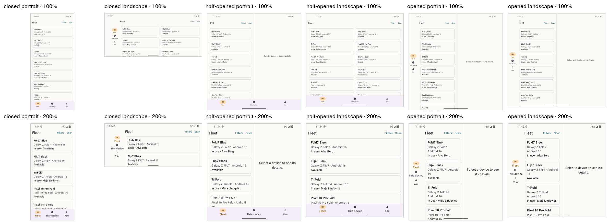
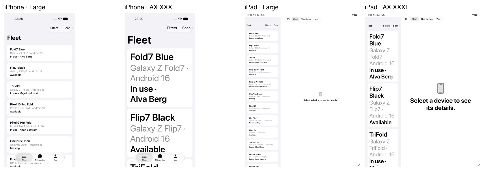
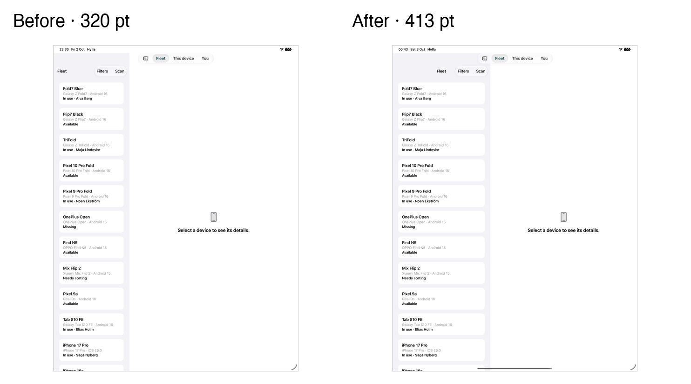

# 20 — Testing adaptive layouts

**Tag:** `chapter-20`

## The concept

Every chapter so far ended with *Verify*. This one collects how: what runs where, which tool
drives which state, and the two screenshot matrices that sweep the fold states and text sizes in
one command.

Adaptive layout is tested in three layers, cheapest first:

| Layer | What it proves | Android | iOS |
| --- | --- | --- | --- |
| **Pure models** | The rules: breakpoints, pane widths, hinge segments, chrome, scan split, filters, the store | 116 JUnit tests, no device | 107 Swift Testing tests, no UI |
| **UI tests** | The rules reach the screen: panes, selection, sheets, back, links, notifications, audits | 22 instrumented tests on `fold_api36` | 24 XCUITests on iPhone and iPad |
| **Matrices and hardware** | What nobody wrote a test for | `scripts/android-matrix.sh`, the SM-F971B | `scripts/ios-matrix.sh` |

The pure models carry most of the weight. `WindowPosture`, `PaneLayout`, `AdaptiveLayout`,
`ScanLayout` and `ChromeLayout` take numbers and return numbers, so a tri-fold, a 320 pt Slide
Over window or a tabletop crease at 45% is a one-line test, not an emulator profile.

## Android: driving a foldable emulator

`fold_api36` is the reference device: a book-style foldable with a cover display.

| To test | Command |
| --- | --- |
| Fold states | `adb shell cmd device_state print-states`, then `state 0` closed, `1` half-opened, `2` opened, `reset` |
| Rotation | `adb shell settings put system accelerometer_rotation 0`, then `user_rotation 0` to `3` |
| Any window size | `adb shell wm size 900x600`, then `wm size reset` |
| Density (and recreation, chapter 19) | `adb shell wm density 300`, then `wm density reset` |
| Text size | `adb shell settings put system font_scale 2.0` |
| Split screen and free-form | `resizable_api36`, or drag a window in desktop mode |

Two habits matter:

- **Instrumented tests name their device.** Run them with `ANDROID_SERIAL=emulator-5556`, so
  that a phone plugged in for something else is never touched.
- **Folded, there are two displays.** `screencap` needs `-d` and the active display's id, or
  it prints a warning *into the PNG*. The matrix script reads the id from `dumpsys display`.

```sh
cd android
./gradlew :app:testDebugUnitTest
ANDROID_SERIAL=emulator-5556 ./gradlew :app:connectedDebugAndroidTest
```

## iOS: simulators and launch arguments

iOS has no fold, so its matrix is window size × text size:

| To test | How |
| --- | --- |
| Compact and regular | iPhone 18 Pro and iPad Pro 13" (M5), iOS 27.2 |
| Any window size | Debug launch argument `-HyllaWindowOverride 330x350`: lays the app out as if the window were that size (the cover display, Slide Over) |
| Resizing live | Stage Manager on the iPad simulator, dragging the window corner |
| Text size | `xcrun simctl ui <udid> content_size accessibility-extra-extra-extra-large`, or `XCUIApplication().launchArguments += ["-UIPreferredContentSizeCategoryName", …]` in a test |
| A clean start | `-HyllaResetDefaults YES`: clears saved settings, the fleet and the journal |

```sh
cd ios
xcodebuild -project Hylla.xcodeproj -scheme Hylla \
  -destination 'platform=iOS Simulator,name=iPhone 18 Pro,OS=27.2' test
xcodebuild -project Hylla.xcodeproj -scheme Hylla \
  -destination 'platform=iOS Simulator,name=iPad Pro 13-inch (M5),OS=27.2' test
```

Tests that only make sense on one device skip with a reason (`XCTSkipUnless`), so the same
suite runs on both and the skip list is part of the result.

## Previews

Previews are the fastest loop for *size* and *text*, not for folds:

- **Android:** `FleetScreenPreviews.kt` puts the fleet at every `@PreviewScreenSizes` size and
  every `@PreviewFontScale` scale, plus a foldable at 200%. A preview has no activity, so the
  posture comes from the preview's window size through the same `WindowPosture.compute`.
- **iOS:** `#Preview` blocks on the fleet, the split view, the detail and the cover screen. Xcode's preview canvas
  shows variants for Dynamic Type and orientation.

Neither sees a hinge, a cover display, a camera or the real window, which is why the emulator and
the matrices exist.

## The matrices

One command, every state, one folder of screenshots.

```sh
ANDROID_SERIAL=emulator-5556 scripts/android-matrix.sh   # build/matrix/android
scripts/ios-matrix.sh build/matrix/ios <iphone-udid> <ipad-udid>
scripts/contact-sheet.py sheet.png 6 380 "label=path" …
```

The Android script runs 3 fold states × 2 rotations × 2 text sizes = 12 screenshots, and puts the
fold state, rotation and font scale back as it found them.



*`fold_api36`: closed, half-opened and opened, in portrait and landscape, at 100% and 200%. Closed is one pane with a bottom bar. Half-opened is one pane with the bar, because tabletop keeps controls off the crease. Opened is list and placeholder beside a rail. At 200% the tiles drop to one column, and nothing is cut.*

The iOS script captures each simulator at the default size and at AccessibilityXXXL.



*iPhone 18 Pro and iPad Pro 13", at Large and AccessibilityXXXL. The iPad list here is the 320 pt one, before the fix.*

**What the matrix caught.** Look at the iPad: the list is narrow. Measured, it is **320 pt**,
under the 360 pt minimum from chapter 4. `PaneLayout` asked for 413. No test had checked a width,
only that two panes existed, and chapter 5's table had reported the computed 413 as if it had
been observed.

Narrowing it down, one variable at a time, measuring the list column in a screenshot each time:

| Change | List column |
| --- | --- |
| None | 320 |
| A fixed `navigationSplitViewColumnWidth(600)` | 320 |
| `.prominentDetail` instead of `.balanced` | 320 |
| No `TabView` around the split view | 320 |
| iPadOS 27.0 and iPadOS 18.6, not the 27.2 beta | 320 |
| **No `.toolbar(removing: .sidebarToggle)`** | **413** |
| **`.toolbar(removing:)` first, the width after it** | **413** |

The width was never reaching the column. Applied *before* `.toolbar(removing: .sidebarToggle)`,
`navigationSplitViewColumnWidth` is lost, and the column falls back to the system's 320 pt. Applied
after it, the column gets what `PaneLayout` asks for. Both split layouts now apply it last.

With that fixed, a width check in the three-pane test found a second gap. In landscape,
`PaneLayout` asks for a 385 pt list and `min: 360, ideal: 385, max: 385` got **360**: with three
columns the system settles on the minimum. A fixed `navigationSplitViewColumnWidth(385)` gets
385. The UI tests now check the list's width on screen, in two panes and in three.



*iPad Pro 13" portrait: the list at the system's 320 pt, and at the 413 pt `PaneLayout` asks for.*

It looked like a beta bug at first, and the first draft of this chapter said so. Running the same
build on the released 27.0 and on 18.6 ruled that out in two minutes.

That is the point of a matrix: it shows what the screen does, not what the code meant.

## Hardware

Emulators are faithful to the API, not to every device. Two findings came only from a real
SM-F971B, both in [hardware findings](../hardware-findings.md):

- The inner display declares no cutout for its camera.
- The keyboard on the unfolded landscape scanner leaves room for only the text field.

Neither would have been found on an emulator, and neither is fixed by a per-model offset: the
window stays the only input.

## The checklist

Before calling a layout change done:

1. A pure-model test for the rule, including a tri-fold and a window smaller than the display.
2. The UI test for the screen, on `fold_api36`, and on iPhone and iPad.
3. Both matrices, with the contact sheets looked at, not just generated.
4. 200% text and AccessibilityXXXL, with TalkBack and VoiceOver on the changed screen.
5. A real foldable when one is on the shelf.
