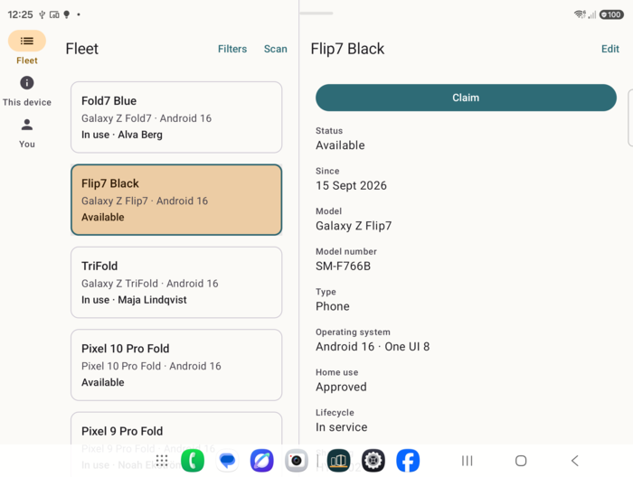
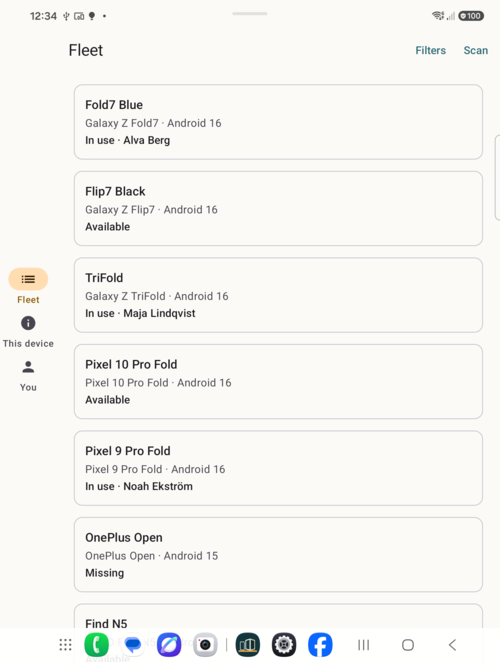
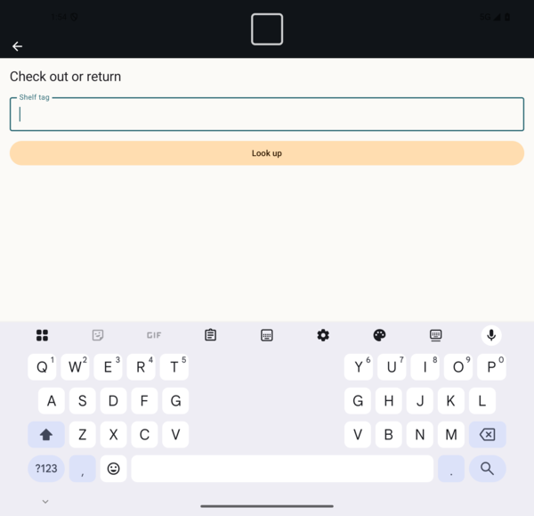

# Hardware findings

What real devices did that emulators and simulators did not. Each entry: the device, what was
seen, the evidence, and what the app does about it. Chapter 19 draws on these.

## 2026-10-02 — SM-F971B inner display declares no camera cutout

**Device:** Samsung SM-F971B, a Galaxy Z Fold, on Android 17 (API 37), One UI 9
(`ro.build.version.oneui` = 90000).

**Seen:** unfolded and held in portrait, the inner display's punch-hole camera sits on the left
edge, at the height of the navigation rail's third item. *You* was drawn under the camera.

**Evidence:** `adb shell dumpsys display` lists two built-in screens:

| Display | Size | State | Cutout |
| --- | --- | --- | --- |
| Inner | 2448 × 1848 | ON | none |
| Cover | 1248 × 1972 | OFF | `insets=Rect(0, 104 - 0, 0)`, bounding rect `(589, 0) – (659, 104)` |

The inner display reports no cutout at all, so `WindowInsets.displayCutout` is zero in every
rotation. Padding the shell by the cutout, which the app now does for side cutouts and waterfall
edges, cannot help: there is nothing to pad by.

**What the app does:**

- Keeps the cutout padding. It is correct on every device that reports its cutout.
- Centres the navigation rail's items vertically. That is a standard Material 3 rail
  arrangement, and on this device it moves the items clear of the camera.

The centring does not *know* about the camera. It avoids it on this window by placement, not by
measurement.

**What the app does not do:** hard-code an offset for this model. The rule of the codelab is that
the window is the only input. A per-model offset would be a second input that silently goes
stale. The right fix is the device declaring its cutout, and this has been noted for reporting to
Samsung.

## 2026-10-02 — The scanner's keyboard on an unfolded Fold in landscape

**Device:** the same SM-F971B, unfolded, landscape, about 930 × 700 dp.

**Seen:** typing a shelf tag on the scanner, only the text field was left above the keyboard;
the title and *Look up* were pushed out of view. The height class is `Medium`, so the scan layout
stacks the viewfinder over the controls at 45%, and the keyboard takes most of what remains.
The emulator's flat portrait window had not shown it.

**What the app does:** while the keyboard is up in a stacked layout, the viewfinder shrinks to a
96 dp strip and the controls take the rest. Tabletop keeps its split at the crease, because there
the viewfinder faces the shelf and the keyboard is meant for the lower half.
